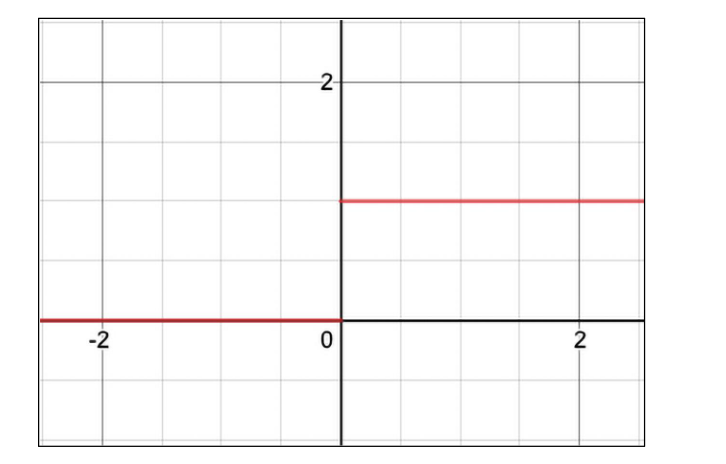
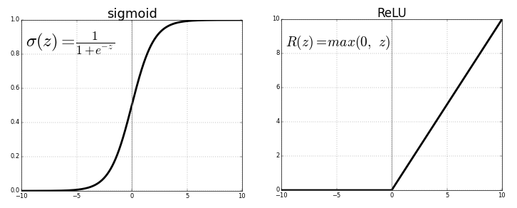
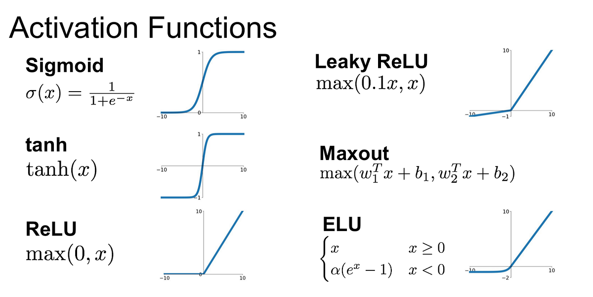

# Chapter 1

All code for this chapter can be found at:
- https://packt.link/dltfchp1

### ANN - artificial neural networks

These are inspired by studies of nervous systems.
Interest started in the 50's 60's with intro of the Perceptron. "Back-propagation" algorithm was created around this time for multilayer training of neural networks, such as a Viterbi matrix.

### Recent breakthroughs

Interest resurged in ML in the mid 2000s due to three reasons (1) the breakthrough fast learning algorithm by G. Hinton., (2) intro of GPUs (3) and big data.

Neural networks went from using 3-5 layers up to 200 layers now.

### Perceptron

A simple function where w - weights, b is bias, and wx is the dot product.

$$
\begin{align*}

\text{f(x)} &=
\begin{cases}
1 & wx + b > 0 \\
0 & \text{otherwise}
\end{cases}
\end{align*}
$$


### Keras API


There are three ways to create a model:
- sequential API
- functional API
- model subclassing

Sequential is the first we go over.
The code has 10 neurons and expects 784 input variables.
Sequential defines a linear pipeline of network layers.

Weights are initialized via 'kernel_initializer'. 
Some options:
- random_uniform
- random_normal
- zero

There are others too.


```python
import tensorflow as tf
from tensorflow import keras
NB_CLASSES = 10
RESHAPED = 784
model = tf.keras.models.Sequential()
model.add(keras.layers.Dense(NB_CLASSES, 
        input_shape=(RESHAPED,), kernel_initializer='zeros',
        name='dense_layer', activation='softmax'))

```


### Multi-layer perceptron

Multiple layers.



A perceptron is either a 0 or 1. Small change in weights changes output without graduity.


Activation function: Sigmoid

the sigmoid function has range (0, 1) for all input.



Also activation function tanh(z) is used. 

ReLU (Rectified Linear Unit) -  simpler to implement. 

is defined by f(x) = max(0, x)

### Additional acticvation functions.

Exponential Linear Unit (ELU) and LeakyReLU



### Recognize Handwritten digits

http://yann.lecun.com/exdb/mnist/ - database of handwritten digits.


One hot encoding, list of categories.
3 = [0 0 0 1 0 0 0 0 0 0]
where this array is a list of 0-9.

