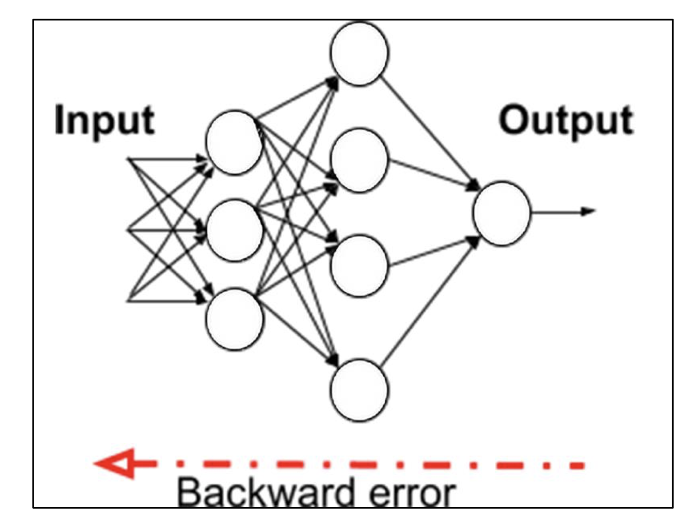

# Chapter 1

All code for this chapter can be found at:
- https://packt.link/dltfchp1

### ANN - artificial neural networks

These are inspired by studies of nervous systems.
Interest started in the 50's 60's with intro of the Perceptron. "Back-propagation" algorithm was created around this time for multilayer training of neural networks, such as a Viterbi matrix.

### Recent breakthroughs

Interest resurged in ML in the mid 2000s due to three reasons (1) the breakthrough fast learning algorithm by G. Hinton., (2) intro of GPUs (3) and big data.

Neural networks went from using 3-5 layers up to 200 layers now.

### Perceptron

A simple function where w - weights, b is bias, and wx is the dot product.

$$
\begin{align*}

\text{f(x)} &=
\begin{cases}
1 & wx + b > 0 \\
0 & \text{otherwise}
\end{cases}
\end{align*}
$$


### Keras API


There are three ways to create a model:
- sequential API
- functional API
- model subclassing

Sequential is the first we go over.
The code has 10 neurons and expects 784 input variables.
Sequential defines a linear pipeline of network layers.

Weights are initialized via 'kernel_initializer'. 
Some options:
- random_uniform
- random_normal
- zero

There are others too.


```python
import tensorflow as tf
from tensorflow import keras
NB_CLASSES = 10
RESHAPED = 784
model = tf.keras.models.Sequential()
model.add(keras.layers.Dense(NB_CLASSES, 
        input_shape=(RESHAPED,), kernel_initializer='zeros',
        name='dense_layer', activation='softmax'))

```


### Multi-layer perceptron

Multiple layers.


A perceptron is either a 0 or 1. Small change in weights changes output without graduity.


Activation function: Sigmoid

the sigmoid function has range (0, 1) for all input.


Also activation function tanh(z) is used. 

ReLU (Rectified Linear Unit) -  simpler to implement. 

is defined by f(x) = max(0, x)

### Additional acticvation functions.

Exponential Linear Unit (ELU) and LeakyReLU


### Recognize Handwritten digits

http://yann.lecun.com/exdb/mnist/ - database of handwritten digits.


One hot encoding, list of categories.
3 = [0 0 0 1 0 0 0 0 0 0]
where this array is a list of 0-9.

Optimizers at
https://tesnorflow.org/api_docs/python/tf/keras/optimizers


Some common choices for loss functions/optimizers:
- mse, mean squared error
- binary_crossentropy, binary logarithmic loss
- categorical_crossentropy, multiclass logarithmic loss


Epochs - number of times model is exposed to training set. At each iteration, adjusts weights so
objective function is minimized.

Batch_size - number of training instances observed before optimizer performs weight update. 
many batches per epoch.


Hidden layers - not directly connected to input/output, stuck somewhere in the middle.

Dropout - can further improve the model. randomly drop some. part of regularization.
Neurons depend less on neighbors, so more independent.

### Testing Different Optimizers

```python
# Compiling the model
model.compile(optimizer='RMSProp', # switched SGD for RMSProp
            loss='categorical_crossentropy',
            metrics=['accuracy'])
```

In this case, RMSProp converges faster in the training set to higher accuracy than SGD.
If training accuracy is not higher than test accuracy, it needs to train longer.

```python
# Compiling the model
model.compile(optimizer='Adam', # switched SGD for RMSProp
            loss='categorical_crossentropy',
            metrics=['accuracy'])
```

Increasing number of neurons or batch size can make a model worse at generalizing.

### Regularization

low error on training data

λ >= 0 hyperparameter for importance of simple model

min : {loss (Training Data | Model )} + λ * complexity (Model)

model is a vector of weights. to prevent overfitting, choose simplest model.
which is model with smaller number of non zero weights.


Three different types of regularization:
- L1 regularization - complexity described as sum of the absolute values of weights
- L2 regularization (Ridge) - complexity as sum of squares of weights
- ElasticNet regularization - Complexity of model captured by combination of two above.

adding regularization
```python
from tf.keras.regularizers import l2, activity_l2
model.add(Dense(64, input_dim=64, W_regularizer=l2(0.01),
        activity_regularizer=activity_l2(0.01)))
```

### Batch Normalization

to speed up training, make layer inputs more similar in distribution.

also, issue is sigmoid function works close to zero, but gets stuck and unable to adjust
weights if outpust fluctuate far away.

activation input x is centered around zero by subtracting the batch mean from it.
manipulate into (x - mean) / ( sum_of_batch_variance + small_number_e)

linear transformation to make sure normalizing effect is applied.
y = λ x + β


### Colab

google colab free rn.

https://colab.research.google.com/

See book for section on running IMDB positive/negative review classifier in colab.

### Prediction Output

```python
# Making predictions
predictions = model.predict(x)
```

### Backpropagation




Backward propagation of optimizer algorithm to adjust weights to minimize error.


